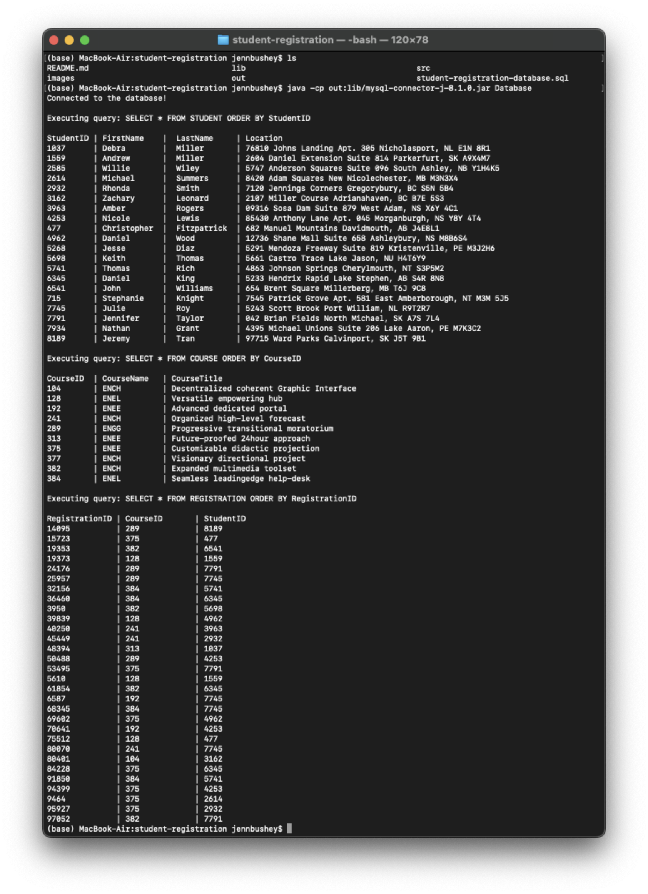

# Student Registration

In this lab, you are asked to implement a student registration scenario, draw an ER diagram of how your database will look like, install a database (PostgreSQL, or MySQL), set up and populate the tables from the drawn diagram in the respective database using either SQL or the Admin GUI, get the JDBC driver from the vendor and use it in java code. In this assignment, you will need to create a database with three tables: Student, Course, and Registration.

You should implement all tables with primary keys and foreign keys.

You should demonstrate three queries:

-   Get all students.
-   Get all courses.
-   Get all registrations.

Tasks:

1. Draw ER diagram
1. Installing the database with JDBC driver
1. Populating the database
1. Correct connection string
1. Demonstrating the three queries via java code
1. Documentation:
    - ER Diagram
    - Output of the three queries

Assignment from ENSF 607 Fall 2023 - completed as a group assignment by Mehreen Akmal and Jenn Bushey.

## ER Diagram

## Output

## Technologies Used

-   Java
-   JDBC
-   MySQL
-   Diagrams were created using [Draw.io](https://draw.io/).
