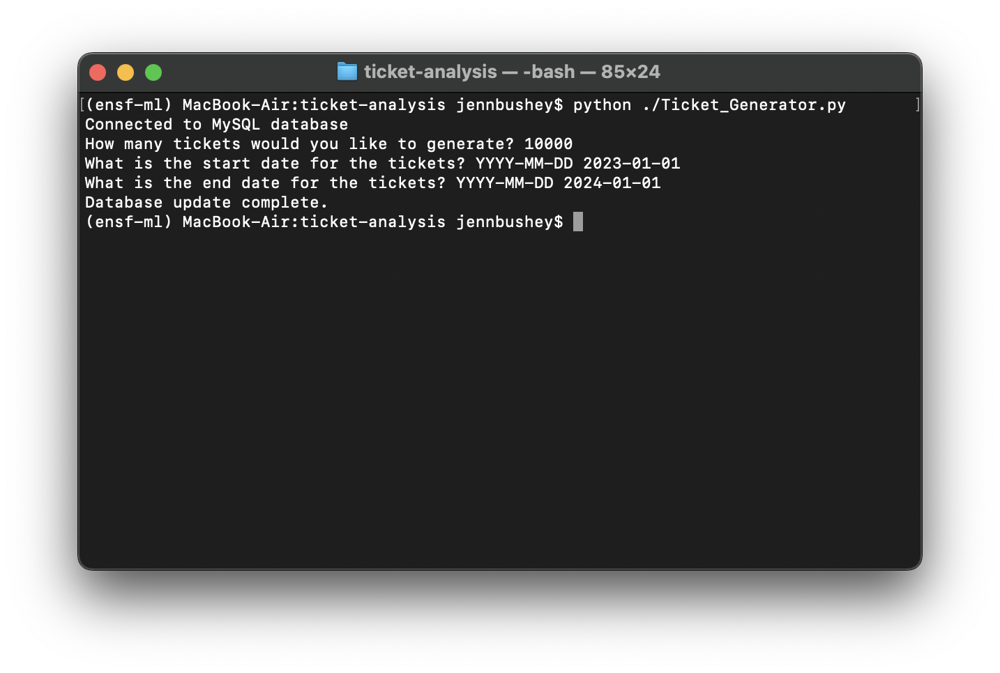
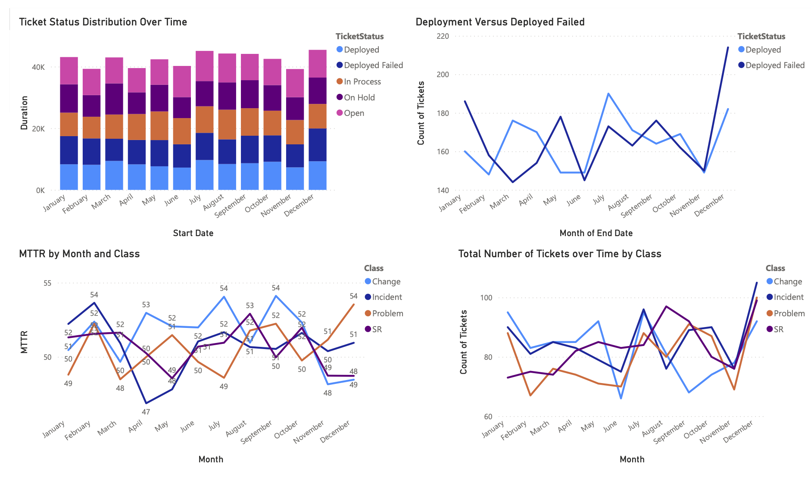

# Ticket Analysis

In this assignment, you will build a dashboard that provides information on service tickets. Since we do not have a file with service tickets we need to create a database with service tickets.

Tasks:

1. Setup a database for service tickets.
1. Develop a ticket generator program.
    1. Since we do not have any sample ticket file you need to write a program to generate tickets. You can either write the program in Java or Python. It should follow the following requirements. All values in the ticket will be randomly determined based on the respective values in the database table. That is as close as we can come to provide a good sample event log.
    1. Input parameters: Number of tickets to generate, time window start datae, time window end date.
    1. Each ticket that the program creates should fall within the provided time window. For example if you create 10000 tickets for the first 6 month of the year your time window is 2023-01-01 to 2023-06-30
1. Develop a dashboard and visualize the ticket data.
    1. Show total number of tickets over time window as graph by class.
    1. Show successful deployment over deployment failures as line chart by month
    1. Show MTTR over time window. MTTR = Duration/Number of Tickets
    1. Try a couple of other interesting dashboards you might come up with. Play around with the generated data.

Assignment from ENSF 607 Fall 2023 - completed as a group assignment by Mehreen Akmal and Jenn Bushey.

## Output

Ticket generation input:

Results of the ticket generation script:

Dashboard:

## Technologies Used

-   Python
-   MySQL
-   Power BI
