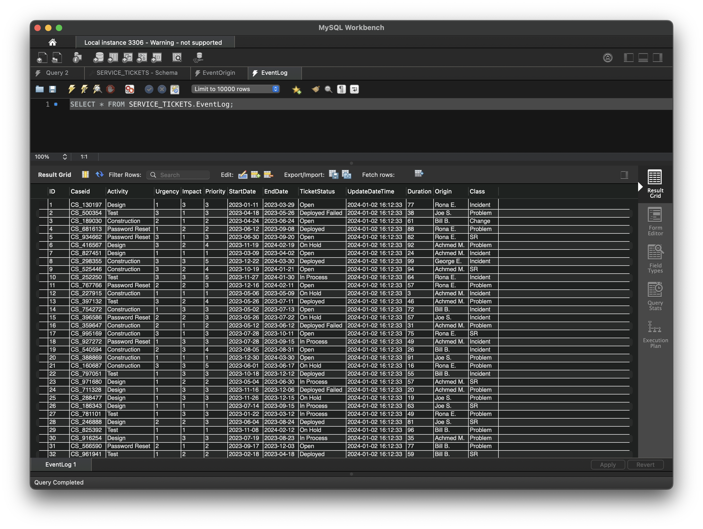
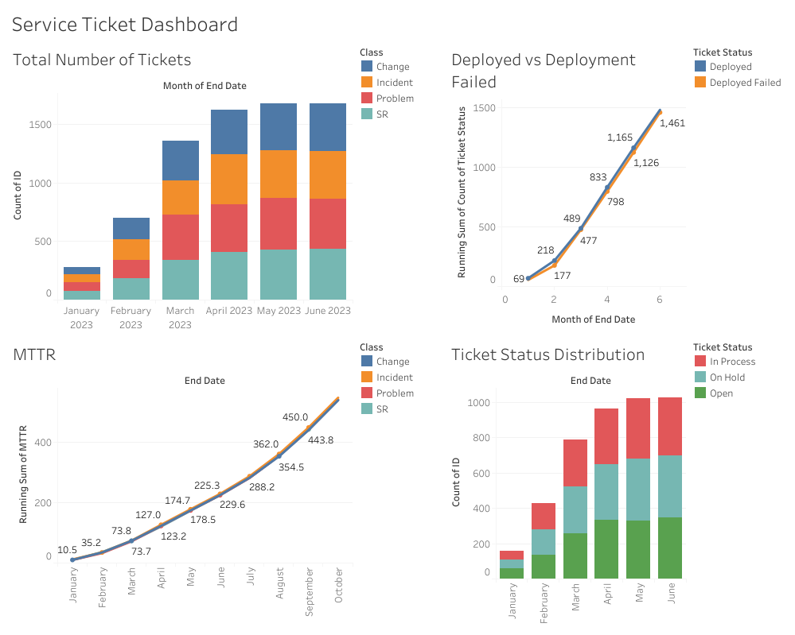
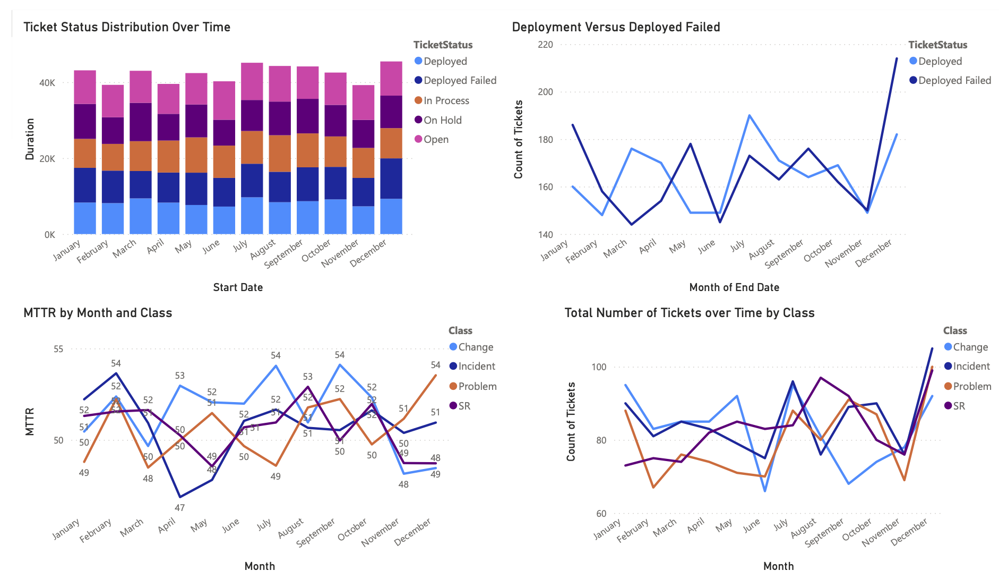

# Service Ticket Dashboard and Analysis

## Overview

This portfolio project focuses on analyzing service ticket data using Python for ticket generation, MySQL for database management, and Tableau / Power BI for visualization. The project aims to demonstrate proficiency in data analysis, database management, and data visualization techniques.

## Objectives

-   Create a program to generate synthetic service tickets based on predefined criteria.
-   Develop a database for storing and managing service ticket data.
-   Build interactive dashboards in Tableau to visualize key performance indicators (KPIs) related to service tickets.

## Project Tasks

1. **Ticket Generator Program**:

    - Develop a Python program to generate synthetic service tickets based on specified parameters such as ticket quantity and time window.
    - Ensure that generated tickets adhere to realistic patterns and distributions.

1. **Database Setup**: Design and implement a database schema for storing service ticket information, including ticket ID, class, status, duration, etc.

1. **Dashboard Development**:
    - Use Tableau to create interactive dashboards that visualize the following KPIs:
        - Total number of tickets over time by class.
        - Distribution of successful deployments versus deployment failures by month.
        - Mean time to repair (MTTR) over time.

## Ticket Generation Script

The ticket generation script is a Python program that generates synthetic service tickets and populates the `EVENTLOG` table in the `SERVICE_TICKETS` MySQL database. The script randomly generates values for each ticket attribute by selecting values from the `EVENTACTIVITY`, `EVENTSTATUS`, `EVENTORIGIN`, and `EVENTCLASS` tables in the database.

The script prompts the user to input the number of tickets to generate, a start date, and an end date for the ticket dates. It then generates random values for each ticket attribute, including case ID, activity, urgency, impact, start date, end date, ticket status, origin, and class, and inserts them into the `EVENTLOG` table.

To ensure data integrity, the script validates the user-provided date range and generates unique case IDs for each ticket. It also calculates the duration of each ticket based on the start and end dates.

Running the script:

```
python ./Ticket_Generator.py
Connected to MySQL database
How many tickets would you like to generate? 10000
What is the start date for the tickets? 2023-01-01
What is the end date for the tickets? 2023-06-30
Database update complete.
```

## Database Construction

The project includes the construction of a MySQL database named `SERVICE_TICKETS` with the following tables:

1. **EventActivity**: Contains the possible activity names.
2. **EventOrigin**: Contains the possible originator names.
3. **EventStatus**: Contains the possible status descriptions.
4. **EventClass**: Contains the possible class descriptions.
5. **EventLog**: Contains the service ticket information, including case ID, activity, urgency, impact, priority, start date, end date, ticket status, update date time, duration, origin, and class.

The database construction SQL script also includes population of the `EventActivity`, `EventOrigin`, `EventStatus`, and `EventClass` tables with initial entries.

Result of Ticket Generation Script:


## Dashboard Development

Tableau Dashboard:


Power BI Dashboard:


### Tableau Public Visualizations

Explore interactive visualizations of the service ticket analysis on Tableau Public:

-   [Tableau Public Visualizations](https://public.tableau.com/app/profile/jenn.bushey/viz/ServiceTicketDashboard/IncidentManagementDashboard)

### PowerPoint Presentation

View the presentation summarizing the project and its findings:

-   [Presentation](./Service%20Ticket%20Dashboard.pdf)

These links provide access to the visualizations and presentation related to the service ticket analysis project.

## Technologies Used

-   Python
-   MySQL
-   Tableau
-   Power BI

## Conclusion

This project showcases the ability to analyze and visualize service ticket data effectively. The use of Python for data generation, MySQL for database management, and Tableau for visualization highlights a comprehensive skill set in data analysis and visualization, which can be a valuable asset in various professional settings.
